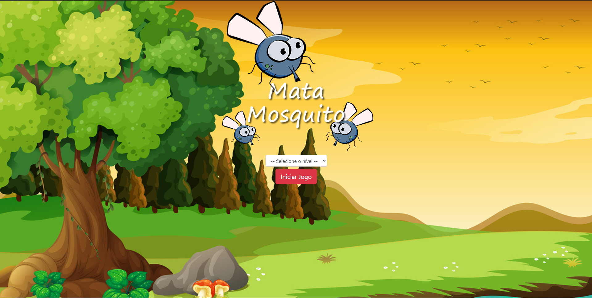

# 🦟 Joguinho de Matar Mosquito

Um jogo simples e divertido onde o objetivo é matar os mosquitos que aparecem na tela dentro de um certo tempo. O jogo possui múltiplos níveis de dificuldade e aumenta a velocidade conforme você progride.



---

## 🎮 Como Jogar

- Mosquitos aparecerão aleatoriamente na tela.
- Clique neles o mais rápido possível antes que desapareçam.
- Cada erro ou atraso reduz suas vidas.
- O jogo termina quando o tempo acaba ou suas vidas chegam a 0.
- Escolha o nível de dificuldade antes de começar (fácil, médio, difícil).

---

## 🛠️ Tecnologias Utilizadas

- HTML5
- CSS3
- JavaScript

---

## 🚀 Como Rodar o Projeto Localmente

1. Clone o repositório:
   ```bash
   git clone https://github.com/seu-usuario/jogo-mata-mosquito.git
